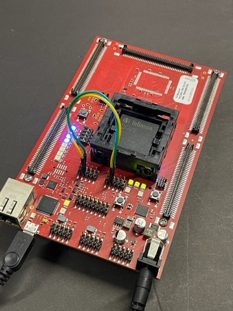
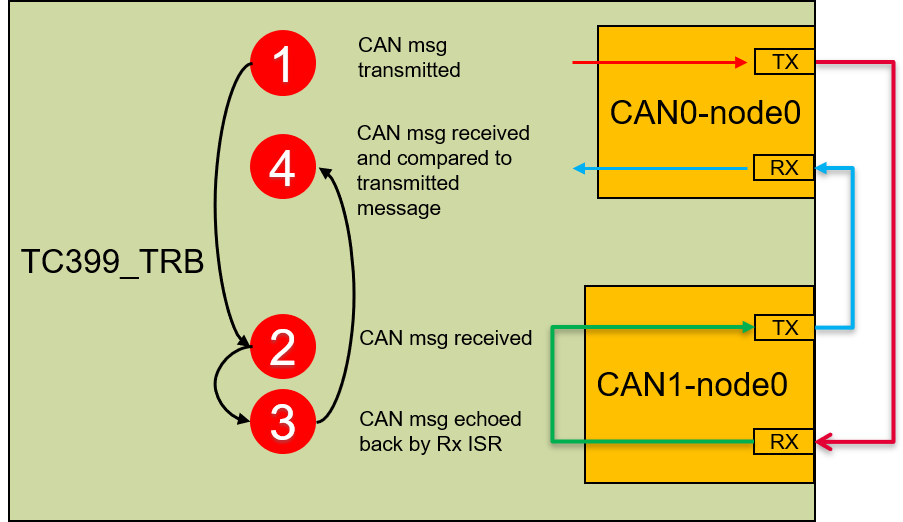

# TC3XX DUAL CAN with External Loop
This demo brings out two CAN interfaces to the two CAN headers on TC39x TriBoard and passes messages in both directions

## Device 
TC3XX
## Board
Tested on TC399 Triboard, but should work on any TC3xx board with two CAN transceivers/headers
## Toolchain
AURIX™ Development Studio (V1.6.0)

## Hardware and connections
* TC399 Triboard – Could be modified for any TC3xx with dual CAN. The Triboard has two CAN transceivers making this example possible.
* Two jumper wires to connect the following:
	* CAN0 header CANH pin <-> CAN1 header CANH pin 
	* CAN0 header CANL pin <-> CAN1 header CANL pin 

### Description
This example is based on the MCMCAN examples in ADS, but modified as follows:
* Uses two CAN modules on TC399 Triboard, CAN0 (node 0) and CAN1 (node 0). 
* Each CAN node is configured for both transmit and receive in the same node.
* No internal loopback. The CAN signals are brought out to the headers.
* CAN0 and CAN 1 are connected with external connection between the two headers
* STM timer is used for a periodic (1s) interrupt. 
* At each STM interrupt CAN0 transmits a message and toggles an LED. Then,  
	* CAN1 receives the message, the CAN1 Rx ISR toggles an LED 
	* CAN1 Rx ISR echoes the message back to CAN0 and toggles an LED
	* CAN0 receives the message, the CAN0 Rx ISR compares it with the original message. 
	* Upon successful comparison, a 4th LED is toggled indicating successful reception of data. 
* LED Description
	* D306 – CAN0 message transmitted
	* D307 – Message from CAN0 received at CAN1 
	* D308 – Message echoed back from CAN1 to CAN 0
	* D309 – Message from CAN1 received at CAN0 and confirmed for correctness

### Demo images

